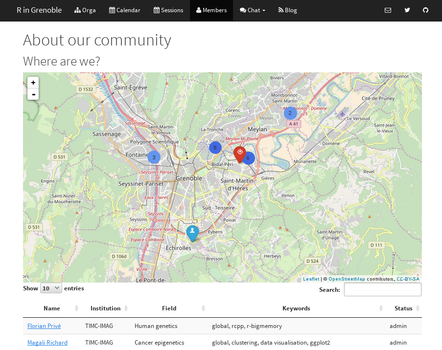

```{r setup, include=FALSE}
options(htmltools.dir.version = FALSE)
knitr::opts_chunk$set(fig.align = "center", dev = "svg",
                      fig.asp = 0.7, out.width = "80%", echo = FALSE)
```

## Thanks for being here

### We weren't expecting so many people

```{r}
knitr::include_graphics("http://www.brunstad.org/getattachment/no/Aktuelt/Bildegalleri/Photo-Gallery-Summer-Conference-July-2013/d.jpg?maxsidesize=940")
```

---

## Today

**Introduction to R** by

- Florent Chuffart (IAB)

- Frédéric Boyer (LECA)

<br>

### Next time (October 19)

**Visualisation with ggplot2**

---

## Second part of the session

- Meet people

- Talk

- Ask for help

- Give some help


---

## Gifts for you

```{r, out.width="20%"}
knitr::include_graphics("sticker.png")
```

```{r, out.width="30%"}
knitr::include_graphics("ecocup.jpg")
```

---

## + Food and Drinks 
### after the presentation, offered by

<br>

<br>

```{r}
knitr::include_graphics("https://www.pacte-grenoble.fr/sites/pacte/files/logo-data-institute-original-1500x375px.jpg")
```

---

## What I ask of you (1/2)

### Become a member of the group

```{r, out.width="70%"}

```

---

## What I ask of you (1/2)

### Fill a questionnaire (30 seconds)

### https://r-in-grenoble.github.io/questionnaire.html

---

class: center, middle, inverse

# Have a good session!
