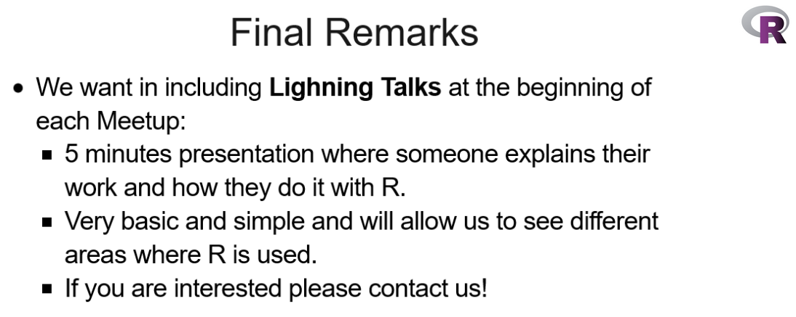
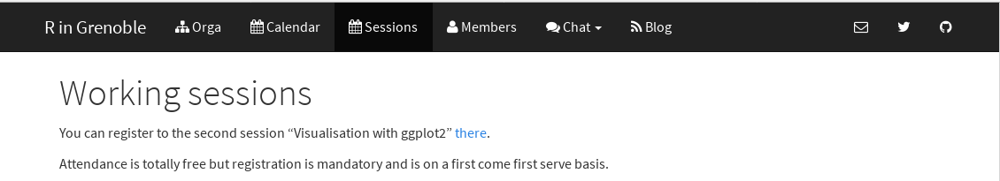
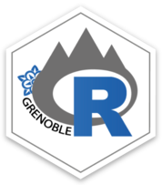
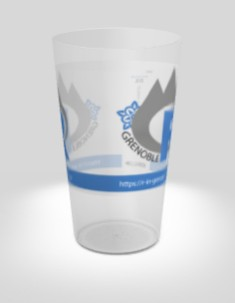

```{r setup, include=FALSE}
options(htmltools.dir.version = FALSE)
knitr::opts_chunk$set(fig.align = "center", dev = "svg",
                      fig.asp = 0.7, out.width = "80%", echo = FALSE)
```

## Next times

</br>

- *Package **igraph*** by S. Achard (November 16)

- *Geographical Information Systems* by F. Boyer (December 14)

</br>

- Next sessions will probably be in French (based on answers from questionnaires)

- Slides and website will remain in English (to share our work with the rest of the world)

</br>

- **Advanced R course** of Grenoble doctoral school (in French) -> ADUM

---

## Idea 1: Lightning talks

### Idea from R-ladies Barcelona

</br>

```{r, out.width="85%"}

```

.footnote[5 min just after the main presentation (at the beginning of the second part)]

---

## Idea 2: find a way to communicate

### Somewhere to chat within this group

</br>

- A Slack team?

- WhatsApp?

- Nothing?

- Any other idea?

---

## Reminder: make sure to register

</br>

```{r, out.width="85%"}

```

</br>

- size of the room

- order food and drinks

- instructions (e.g. install some packages)

---

## Second part of the session

- Meet people

- Talk

- Ask for help

- Give some help

---

## Gifts for you + food and drinks 

```{r, out.width="15%"}

```

```{r, out.width="18%"}

```

<center>offered by

```{r, out.width="65%"}
knitr::include_graphics("https://www.pacte-grenoble.fr/sites/pacte/files/logo-data-institute-original-1500x375px.jpg")
```

---

class: center, middle, inverse

# Please ask me (and others)
# if you want some help 
# or just come talking!
